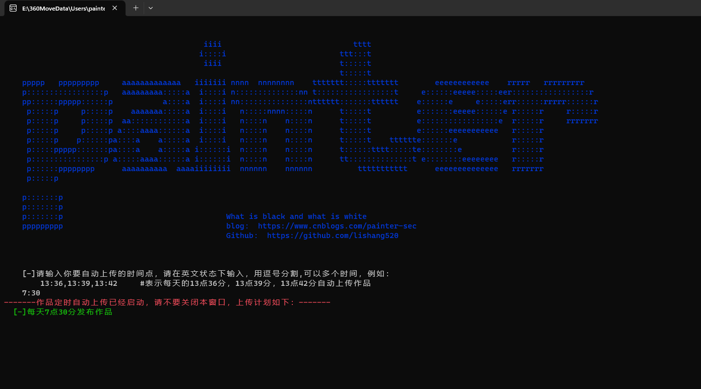
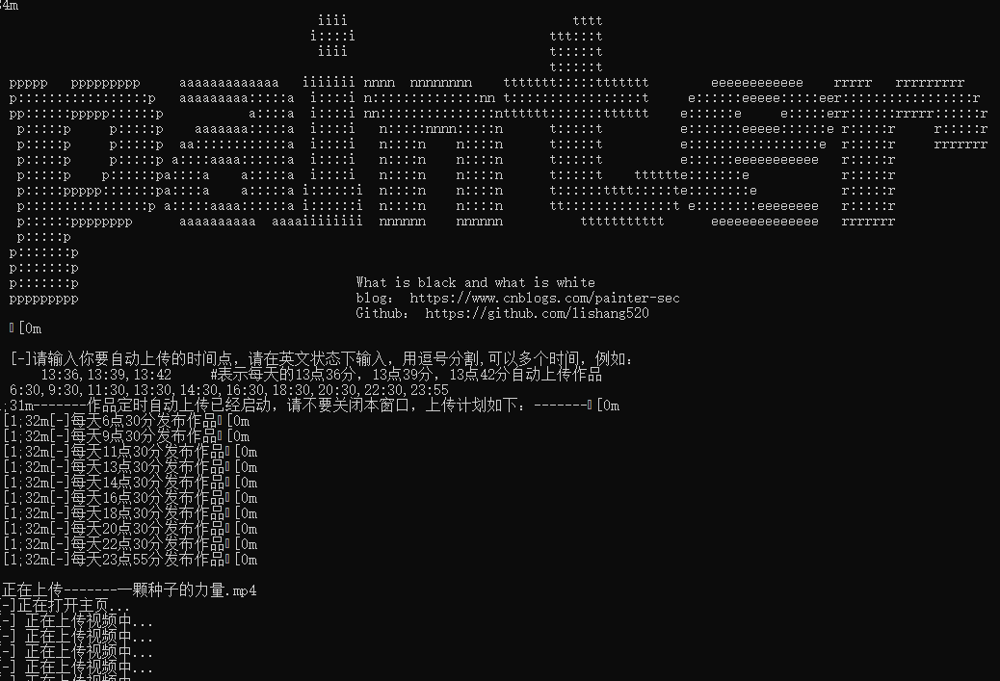
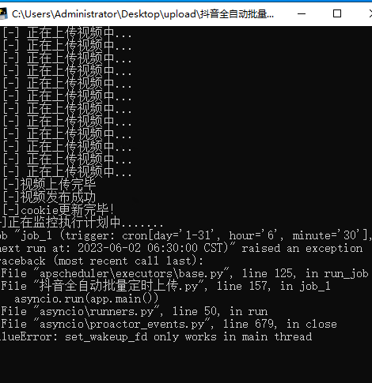

# 抖音定时自动上传工具

关键词：抖音、DouYin、上传、抖音上传、自媒体、上传工具、定时上传、短视频、auto upload

## 一、基本信息

### 1、主要功能

- 全自动
- 可以定时，设定时间点自动上传
- 支持多个定时
- 已经生成了exe，可以直接运行
- 支持cookie维持

### 2、测试环境

- win11
- windows server2022中文版

### 3、软件运行截图

- 
- 

### 4、代办

- 和之前编写的全自动短视频生成工具组合起来
- 编写GUI图形化界面

## 二、实现思路

### 1、我的工作

代码基于Superheroff大佬的项目修改。

主要修改部分：

- 删除了Superheroff大佬的短视频生成的函数
- 删除了Superheroff大佬的微软语音合成的函数
- 对自动上传的类 pw进行完善，通过实际运行，修改部分不适配的地方：比如对视频是否上传完成进行了判断，去掉了原先的默认等待30秒
- 添加了批量上传的功能：增加了get_filenames()函数
- 增加了用户自定义上传时间的功能：通过input来实现，并对用户输入的字符进行替换，防止用户输入错误
- 对程序的运行过程进行打印，让用户能够更加直观看到界面

### 2、使用教程

使用方法：

- 直接双击exe，第一次运行，在弹出来的浏览器里扫码登录抖音
- 输入你的定时的时间，多个时间之间用逗号分隔，输入完成后回车即可
  - 例如：  13：24，20:10
  - 标准输入应该都是英文状态下的符号，但程序做了过滤，输入中文的也没问题
- 当回车后，会自动显示你当前的计划任务，此时你可以做其他事情去了，不要关掉该窗口

使用建议：如果想24小时，可以购买服务器，具体哪个环境可以用，可以参考上面我写的测试环境

### 3、注意事项与问题

注意事项：

- windows server2011 运行不了，2022的可以运行
- 第一次运行，会加载一下环境，然后会自动打开浏览器，会让你登录抖音，此时需要你抖音扫码登录，登录完成后，关掉浏览器，他会自动生成cookie.json，以后就不需要手动登录了
- 目录下必须要有source_videos 文件夹，文件夹最少放一个视频

当前问题：

- 在windows server上运行有报错提示，但是不影响，还是可以正常上传，忽视即可
  - 

## 三、相关链接

0、软件下载连接：[lishang520/DouYin-Auto-Upload (github.com)](https://github.com/lishang520/DouYin-Auto-Upload)

1、该项目大部分基于Superheroff大佬的项目，感谢大佬的分享：[Superheroff/douyin_uplod: 抖音自动上传视频 (github.com)](https://github.com/Superheroff/douyin_uplod)

2、我的blog：[painter520 - 博客园 (cnblogs.com)](https://www.cnblogs.com/painter-sec)

3、我的github：https://github.com/lishang520?tab=repositories
